# Linux Architecture & The Nature of Distributions

## 1. The Big Picture: How it all fits together

To understand Linux, you must visualize it as layers. The Kernel is the "bridge" between the physical world (Hardware) and the digital world (Applications).


### ASCII Diagram (In case the above doesn't render)

```text
+---------------------------------------------------+
|                  USER SPACE                       |
|  +-------------+   +---------+   +-------------+  |
|  | Applications|   |  Shell  |   |    Tools    |  |
|  | (Chrome...) |   | (Bash)  |   | (ls, cp...) |  |
|  +------+------+   +----+----+   +------+------+  |
|         |               |               |         |
|         v               v               v         |
|  +---------------------------------------------+  |
|  |          Standard Libraries (glibc)         |  |
|  +----------------------+----------------------+  |
|                         | System Calls            |
+-------------------------|-------------------------+
                          v
+-------------------------|-------------------------+
|                 KERNEL SPACE                      |
|                                                   |
|          +-----------------------------+          |
|          |        LINUX KERNEL         |          |
|          | (Scheduler, Memory, VFS...) |          |
|          +--------------+--------------+          |
|                         |                         |
|          +--------------+--------------+          |
|          |       DEVICE DRIVERS        |          |
|          | (WiFi, GPU, USB, Disk...)   |          |
|          +--------------+--------------+          |
|                         |                         |
+-------------------------|-------------------------+
                          v
+-------------------------|-------------------------+
|                  HARDWARE                         |
|    [ CPU ]  [ RAM ]  [ DISK ]  [ NETWORK ]        |
+---------------------------------------------------+
```

## 2. Where do Drivers fit?
Notice simply that **Drivers are part of the Kernel**.
*   In Windows, drivers are often separate files (`.dll`, `.sys`) installed by users.
*   In Linux, most drivers are built **directly into the kernel** or loaded as **Modules** (`.ko` files, like your `hello.ko`).
*   This is why `hello.ko` had access to `printk` (kernel log) but `printf` (C library) didn't work. You are running in the **Kernel Space**, directly talking to hardware/resources.

## 3. Kernel vs. OS vs. Distribution

This is the most common point of confusion.

| Term | Analogy | Technical Definition | Example |
| :--- | :--- | :--- | :--- |
| **Linux Kernel** | The Engine | The core code that manages resources (CPU, RAM) and drivers. | `linux-5.15.tar.gz` |
| **Operating System** | The Car (Engine + Chassis) | The Kernel + Basic Userspace Tools (Shell, Init, Compiler). | "GNU/Linux" |
| **Distribution** | The Car Model (Honda Civic) | The OS + Package Manager + Default Configs + Branding + Support. | Ubuntu, Fedora, Alpine |

### Scenario: "I built the kernel, do I have an OS?"
Technically, **no**. You have an engine lying on a garage floor.
*   It runs, but you can't "drive" it because there's no steering wheel (Shell) or dashboard (GUI).
*   **BusyBox** gave you the steering wheel.
*   **Initramfs** gave you the chassis (filesystem).
*   Together, `Kernel + Initramfs + BusyBox` formed a **Minimal Operating System**.

## 4. Why do Distributions differ if they use the same Kernel?
If Ubuntu and Fedora both use Linux Kernel 6.0, why are they different?

1.  **Package Management**:
    *   **Debian/Ubuntu**: Use `.deb` files and `apt`.
    *   **RedHat/Fedora**: Use `.rpm` files and `dnf`.
    *   **Alpine**: Uses `.apk` files and `apk`.
    
2.  **User Space Libraries (libc)**:
    *   Most (Ubuntu, Fedora) use `glibc` (big, compatible).
    *   Alpine uses `musl` (tiny, fast, but strict). *This is why we had trouble with the BusyBox binary!* The one we downloaded first might have expected `glibc`, but we needed a static one or one matching the system.

3.  **Init System**:
    *   Most use `systemd` (complex, powerful).
    *   Alpine uses `OpenRC` (simple, script-based).

4.  **Patches & Config**:
    *   Ubuntu might compile the kernel with "Support for every hardware ever made" (Big Kernel).
    *   Arch Linux might compile it "Generic and minimal".
    *   Android uses a heavily modified Linux kernel (different power management).

## 5. Summary
*   You built the **Kernel** (the boss).
*   You used **BusyBox** (the staff) to take orders.
*   You packaged them into a **Rootfs** (the office building).
*   Together, they make a working system!

## 6. Visualizing the Kernel Startup (The "Boot" Process)
You asked for an interaction diagram of how the kernel starts. Here is the simplified flow from the code we looked at (`init/main.c`).

```mermaid
sequenceDiagram
    participant BL as Bootloader (Grub/QEMU)
    participant K as start_kernel()
    participant S as Subsystems
    participant P2 as kthreadd (PID 2)
    participant P1 as init (PID 1)

    BL->>K: Jumps to Kernel Entry
    Note over K: 1. Setup Phase (Single Core)
    K->>K: setup_arch() (CPU/Ram checks)
    K->>K: trap_init() (Handle interrupts)
    K->>K: mm_init() (Initialize Memory Manager)
    K->>K: sched_init() (Initialize Scheduler)
    
    Note over K: 2. Core Ready
    K->>S: do_basic_setup() (Drivers, Workqueues)
    
    Note over K: 3. Spawning Processes
    K->>K: rest_init()
    K->>P2: Create kthreadd (Manages kernel threads)
    K->>P1: Create kernel_init() (The first thread)
    
    Note over P1: 4. User Space Transition
    P1->>P1: Unpack Initramfs to RAM
    P1->>P1: Look for /init file
    P1->>P1: run_init_process("/init")
    Note right of P1: 🚀 SWITCH TO USERSPACE (BusyBox)
```



### ASCII Boot Flow
```text
[ Bootloader ]
      |
      v
[ start_kernel() ]  <-- The "Main" function of Linux
      |
      +--> setup_arch()    (Check CPU, RAM)
      +--> mm_init()       (Setup Memory Allocator)
      +--> sched_init()    (Setup Process Scheduler)
      |
      v
[ rest_init() ]     <-- Create the first threads
      |
      +--> Spawns PID 2 [kthreadd] (Helper for kernel tasks)
      +--> Spawns PID 1 [kernel_init]
             |
             v
      [ kernel_init() ]
             |
             +--> Unpacks initramfs.cpio.gz (Ramdisk)
             +--> Finds "/init" script/binary
             +--> CALLS run_init_process("/init")
                        |
                        v
              [ USER SPACE REACHED! ]
              (The kernel is now just listening for System Calls)
```

## 7. Why QEMU? (Why can't I run Linux from command line?)
You might wonder: *"I compiled a program called `vmlinux`. Why can't I just run `./vmlinux` like I run `./hello_world`?"*

### The "Matrix" Analogy
*   **Running a Program (`./hello`)**: You are a *guest* in a hotel (macOS). You ask the concierge (macOS Kernel) to do things for you. "Please show this pixel", "Please write to this file". You serve the OS.
*   **Running a Kernel (`vmlinux`)**: The Kernel expects to be the **Owner** of the hotel. It expects to directly control the lights, the water pipes, and the locks.

If you ran `./vmlinux` on macOS:
1.  Linux would try to **overwrite the CPU's interrupt table** (CRITICAL ERROR: Access Denied).
2.  Linux would try to **map physical RAM** directly (SEGFAULT).
3.  macOS would kill it immediately because it's behaving like a virus/malware.

### Enter QEMU
QEMU is an **Emulator**. It is a program that *pretends* to be a computer.
*   It creates a "Virtual CPU".
*   It creates "Virtual RAM".
*   It creates "Virtual Hard Drives".

When you run `qemu ... -kernel vmlinux`:
1.  QEMU builds a fake motherbord.
2.  QEMU loads your `vmlinux` file into the fake RAM.
3.  QEMU tells the fake CPU: "Start executing at this address."
4.  Linux wakes up! It thinks it owns the place. It talks to the CPU, and QEMU translates those requests.

**Summary**: You need QEMU because the Kernel is not a program *for* an OS; it **IS** the OS. It needs hardware (real or virtual) to run on.

## 8. Deep Dive: The Bootloader & `bzImage`

You asked: *"We didn't pass `vmlinux`, we passed `bzImage`. What is the difference?"*

### The `vmlinux` File
*   This is the **Raw Uncompressed Kernel**.
*   It is an ELF file (like a normal binary), but huge (hundreds of MBs with symbols).
*   It is what `gdb` uses to debug.
*   **Problem**: It is too big to be loaded by old BIOSes or bootloaders easily.

### The `bzImage` File ("Big ZImage")
*   This is a **Compressed Package**.
*   Think of it like a Self-Extracting ZIP file.
*   Structure:
    1.  **Bootstub (The Header)**: Small assembly code that sets up memory.
    2.  **Decompression Code**: Tiny C program to unzip data.
    3.  **Piggy.o**: The compressed `vmlinux` binary.

When QEMU loads `bzImage`:
1.  It runs the **Bootstub** (`arch/x86/boot/header.S`).
2.  The Bootstub switches the CPU from "Real Mode" (16-bit, like 1980s DOS) to "Protected Mode" (32-bit).
3.  It jumps to **Decompression Code** (`arch/x86/boot/compressed/head_64.S`).
4.  That code unzips the kernel into RAM.
5.  Finally, it jumps to the *real* `start_kernel()` in `vmlinux`.

### Source Code Tour
You wanted to see the code? It lives in `arch/x86/boot/`.

1.  **The Entry Point**: `arch/x86/boot/header.S`
    *   This is the very first instruction executed.
    *   It looks like "Header Magic" (`HZ` bytes) to tell the bootloader "I am a Linux Kernel".

2.  **The C Bootloader**: `arch/x86/boot/main.c`
    *   Yes, Linux has a mini-bootloader written in C!
    *   It checks the keyboard, detects video modes, and queries BIOS for memory maps.

3.  **The Decompressor**: `arch/x86/boot/compressed/misc.c`
    *   Contains the `decompress_kernel()` function.

So, `bzImage` = `Bootloader` + `Compressed vmlinux`.
